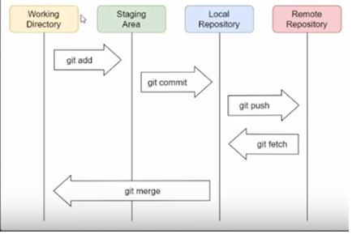

Git
깃은 소스컨트롤 부분에서 주 기능
-> 코드 ,특정 파일 수정 -> 내역을 확인하는 역할
깃 허브는 깃을 이용을 해서 수정했던 내용을 다른 서버에 저장을 하고 싶을떄 그 서버를 제공하는 호스팅 업체라고 생각하면 됨

빗 버캣
깃랩->호스팅도 되고 다운 받아서 자체 서버 운영도 가능

1강. 설치

협업 프로젝트를 위한 Git Hub 

1.New Repository 로 저장소를 만들기
-소스, 프로젝트가 담기는 공간
-Git-Tutorial 이라는 이름으로 만들기 ( 연습)
public/private 
기본적으로 public으로 설정해야 누구든지 볼 수 있는 것 대신 무료
아래쪽에 있는 git-ignore / license는 다양한 파일들을 올릴건데 
어떤 것을 올리고 안올리고 할것인지
git ignore 는 데이터베이스등 다양한 환경설정 진행하는 파일들은 git ignore로 올라가지 않도록 하는 것
라이센스는 오픈소스 라이센스중에서 어떤 것을 채택하는것인지 

HTTP /SSH 2가지 형태
일반적으로 HTTP 

깃소프트웨어 설치
git-scm.com
윈도우 버전 다운로드

설치를 할때는 기본적인 설정을 다 따라야됨

깃 명령은 cmd 명령프롬프트를 이용해서 할 예정임
cmd  깃 명령어 

git
git  --version 

git – hub와 연동하고 저장소로 사용하기 위해서는 환경설정이 필요 
git config --global user,name kimhankyeol  (git name)
git config --global user.email kimhk1030@naver.com (git email)
//글로벌 옵션을 넣어줌으로써 컴퓨터 전체에서 동일한 옵션 

깃환경설정을 해주면 안정적으로 사용가능

test를 위해서 하나의 폴더를 만듬

만들고  HTTPS
https://github.com/kimhankyeol/Git-Tutorial.git  복사

하고 우리가 만든 폴더 위치로 이동
cd  폴더위치       

git clone https://github.com/kimhankyeol/Git-Tutorial.git
클론은 다운로드 개념 

생성한 폴더에 들어가면 Git-Tutorial 이라는 폴더 있고 그 안에 .git이라는 폴더 있음 
없으면 숨김 해제

txt 파일 하나만들고 아무거나 입력

명령프롬프트 가서 Git-Tutorial 로 이동
만든 txt 파일을 추가하기 위해 git add document.txt
추가하고 
커밋
git commit –m “Add Text File [document.txt]”
커밋 메시지를 담아서 커밋

  커밋을 함으로 실제로 파일이 업로드가 된 시점을 마치 스냅샷으로 찍어놓을수있음 프로그램이 문제가 생겼을 때 복구 할 수 있음

커밋후 푸쉬 
git push
푸쉬를 통해 원격저장소로 보냄

2강.
오픈소스의 개요 오픈소스 활동하는 이유
오픈소스 공개된 소스코드 

컨트리뷰션 말 그대로 기여한다는 의미 기능 추가, 보안 취약점 수정 뿐 오타수정 번역 의견제시 등  사실상 누구나 컨트리뷰션 
어떠한 이익도 없을거 같은 오픈 소스 활동 컨트리뷰션 왜하는것인가?
1. 오픈소스 활동 구직활동할 때 이력으로 남는다.
2. 내가 작업한 새로운 기능을 다른 개발자들도 사용해보고 이를 평하하여 개선시킬수있음

커미터는  실제로 누군가 컨트리뷰션을 하면 해당 내용을 리뷰하고 실제 프로젝트에 반영할지를 결정하는 사람 다시말해 특정한 프로젝트를 오픈 소스로 만들어서 관리하는 사람들을 의미합니다.

프로젝트를 왜 오픈소스로 공개하여 누구나 볼수있도록 하는걸ᄁᆞ
1.사회공헌
2.소프트웨어의 품질향상
3.어쩔수없이
오픈소스 라이센스 때문에 

대표적인 오픈소스
MIT License   무료 , 배포가능 , 소스코드 수정가능 ,2차저작물 공개의무 없음
Apache License 무료 , 배포가능 , 소스코드 수정가능 2차 저작물 공개의무 없음
Gpl 무료, 배포가능 ,소스코드 수정 가능 ,2차저작물 공개의무있음
BeerWare

3강 
깃이 등장한 배경 깃의 장점

깃을 이용하면 하나의 프로젝트를 여러 사람들과 함께 효과적으로 관리하여 협업할수 있다.
실제로 오픈소스를 효과적으로 관리하기위한 목적으로 깃이 만들어짐

예 
동시에 프로젝트를 작업해야 한다는 점에서 매우 큰 난항 겪음
깃과 같은 협업 관리 도구가 없으면 쉽지 않다.
깃은 여러명이 병렬적으로  개발을 할 수 있게 해준다는 점에서 프로젝트 개발 속도를 매우 빠르게 해줌
실제로 리눅스를 포함해서 다양한 오픈소스 프로젝트들은 수천명이 넘는 개발자가 포함되어 있는데 이들의 작업 내역을 어떻게 효과적으로 관리할 수 있는지르 깃을 제대로 배웠을 때 이해할수 있다.
리눅스도 오픈소스 프로젝트임
torvalds /linux
장점 개발자의 현실적인 장점은 포트폴리오 관리에도 용이하다는 것.
깃 허브에 자신이 작업한 프로젝트를 나열하여 얼마나 추가적으로 프로젝트를 관리하고 있는지 모두 드러나기 때문임

SVN 은 기본적으로 중앙서버가 존재한다는 점에서 Git 과 차이점 존재 

깃은 중앙서버 없이 분산형으로  협업가능.
그 서버가 망가졌을 때 다른 컴퓨터로부터 소스코드를 복구할수 있음

깃의 장점
1.분산적인 개발
-깃을 사용하는 전체 개발 내역을 각 개발자의 로컬 컴퓨터로 복사 할 수 있음
-서로 수정된 내역을 합치기(Merge) 가능 
2. 효율적인 개발
-깃은 일반적인 다른버전 관리 시스템 보다 성능이 뛰어나면 변경이력이 많더라도 변경된 내용만 처리한다는 점에서 메모리적인 효율성 또한 뛰어나다.
3.비선형적인 개발
-깃은 브랜치라는 개념이 사용된다. 다시 말해 프로젝트의 가지치기가 가능 트리구조, 비선형적인 구조
서로 작업한 내용이 다를떄 충돌발생했을떄 이를 효과적으로  관리
4.변경이력 보장
-작업된 모든 내역 commit 내역 모두 별도의 영역에서 관리되어 안전하게 프로젝트를 운영할 수 있습니다.

4강 .깃의 동작 원리

깃 프로젝트에 담겨 있는 데이터들은 파일시스템상에서의 스냅샷이라고 볼 수 있다.
실제로 프로젝트를 커밋하여 적용할때에 순간을 중요시하는 특징있음
파일자체를 저장하기 보다 수정내역 자체를 저장

동작원리를 이해하기 위해서 
git프로젝트의 세가지 구성요소
Working Directory: 작업할 파일이 있는 디렉토리
Staging Area: 커밋을 수행할 파일들이 올라가는 영역  
Git Directory: Git 프로젝트의 메타 데이터와 데이터 정보가 저장되는 디렉토리임
-깃폴더를 의미

local repository 컴퓨터 자체에 있는 깃폴더
커밋만 했을떄는 로컬에만 
push를 해야 Remote Repository 에 올라감 깃허브 사이트

다른 사람이 작업한 데이터를 받기 위해서 
git fetch

conflict 발생하는 경우
Remote 와  로컬 컴퓨터 동기화 해줘야됨

git merge 
수행

git fetch 와 git merge를 한번에 수행할수 있는 git pull을 많이 사용함

저장소 (Repo) 
실제 소스코드가 담겨있으면서 커밋 내역등의 모든 작업 이력이 담겨 있는 공간

각종 수정 내역과 설정들이 .git 폴더 안에 들어있음
실제로 이 폴더를 열어보면 각종 데이터와 해시값이 담겨있음 

내부적인 것은 깊게 안알아도되고 동작원리만 이해하면됨

5강. 소스코드를 수정하여 Git저장소에 반영하기 
크게 2가지 경우 
1. 해당 프로젝트에 소속된 사람이 아닌 경우
만약 우리가 특정한 커뮤니티의 구성원이 아니라서 스스로 커밋을 하여 , 저장소에 적용할 권한이 없다면 , 소스코드를 수정하는 것에 제약이 있다. 
이런 경우 PR(pull request)를 작성하여 오픈소스에 기여 가능 
이 경우는 큰 오픈소스 프로젝트의 구성원으로 참여하고 싶을 때 사용하는 방법. PR에 수정사항등을 담아서 전송하면 해당 오픈소스의 관리자가 이를 허용했을 때 실제로 오픈소스에 반영이 될수 있다.

//일반적인 경우
2. 해당 프로젝트에 소속된 사람인 경우

자신이 해당 프로젝트에 대한 권한을 가지고 있으므로 그냥 커밋 하고 푸쉬해서 저장소에 수정 내역을 반영하면 됨

소스코드 수정 깃 저장소 반영
1. 마이페이지 – 리포지토리 들어감
2. 새로운 클론으로 프로젝트 다운로드 해서 그 상태에서 소스코드 수정하여 업로드 진행
3. git clone 복사한url
4. 자바 class 파일을 하나 만들어봄
5. git status  상태  확인 하면 만든 파일을 확인할수있음
특정한 파일이 추가 되었다는 것을 알 수있음
6. git add 로 staging area 에 올림

7.만약 add한 파일을 staging에서 내리고 싶으면 
git reset testGit.java 
하면 staging에서 리셋됨

8.만약 모든파일을 add 시키고 싶으면 
git add .

9.커밋 
git commit –m “Add testGit.java [Add]”

10.푸쉬 
git push
푸쉬하면 깃허브에 올라감

11. 올라간 파일에 파일을 수정해서 다시 올려보겠음
파일을 수정하고 

git status 하면 빨간색 표시로 파일명이 되있음
또한  2가지 선택지가 있음 
git add       //수정된 내역 추가
git checkout -- 파일명   // 수정된 내역 무시   이것을 실행하면 원래상태로 돌아옴

12. add 하고 커밋
예)커밋메시지를 잘못 넣었을떄
git commit –m “Add my_module [Sub]”

git commit --amend
i  누르고 수정후 :wq

13. git status 확인하고 git push

6강. git에서 commit 내역 수정하기
commit 스냅샷 같은
commit  되돌리고 싶을 때

1. git pull 
-깃허브에 올라온 소스코드와 로컬에 있는 소스코드를 동기화 하기 위해  pull을 해줌
2. 특정지점으로 되돌릴거임
 - 아까 만든 파일에 소스 추가
 -staging area 에 올림
 -add   commit     status push

반영된 내역들은 git log를 이용하여 볼수 있음
로그를 그만 보고 싶으면 q  

커밋을 확인하고 싶으면 commit의 해쉬값으로 커밋내용을 지칭할 수 있음

3. 예전에 상황으로 돌아가고 싶다면
git reset --hard [커밋지점의 해쉬값]
f1bcf2a55160abc6de68042b06e60c034a1ba5f6
hard 옵션은 특정한 커밋지점에 이후는 다 지워버리겠다.
mixed 옵션도 있음
git log를 찍어보면 내가 지정한 이후의 커밋은 다 지워짐

이제 로컬 장소로 돌아가서 확인해보면 커밋한 지점의 소스코드로 돌아옴

하지만 깃허브  원격 저장소에는 적용이 안되어있음

이 상태로 push를 하면 오류가 뜸 
로컬 저장소와 깃허브 저장소에 구성요소가 달라졌기 때문에 오류뜸
rejected ...

이런상황에서 강제로 푸쉬를 할수 있긴하다.
git push –f

여기까지는 특정시점으로 되돌렸음

이제는 커밋메시지 변경을 해볼거임
java 파일을 만들고 소스추가 후
git add . 
git status
git commit –m “Add TestGit [Add]”
git push

그 상태에서 코드 추가 할거임
하나의 파일에서 코드 추가를 했으니 어느 부분이 변경되었다고 커밋메시지를 변경해야됨

git commit —amend  //이거는  커밋메시지만 바꾸고 싶을 때 인거 같음
로 바꾸면 됨

git status로 확인
git log 로도 확인
이 상태에서 강제로 푸쉬
git push –f

이러면 잘못한거임 커밋메시지만 바뀌게됨 
그래서 다시  commit 메시지를 돌리고
[Add]

7강 Git 브랜치의 개요 및 사용해 보기

깃에서 브랜치를 사dygsksm 방법에 대해서 알아보도록 함
깃은 동시에 여러개발자들이 프로젝트에서 각기 다른 기능을 개발 할 수 있도록 브랜치 기능 제공
브랜치를 잘 활용하면 안정적으로 프로젝트가 끊기지 않게 작업을 할 수 있음
서로 다른 목적으로 브랜치 운영 가능

깃을 만들게 되면 마스터 브랜치가 생성됨 
이 브랜치는 일반적으로 배포가 가능한 수준의 안정화된 버전을 포함

따로 따로 빼서 병렬식으로 개발
특정한 부분에서 개발하고 싶으면 develop branch 로 
여기서 버그가 발견되면  버그수정은 
디버깅 bug fix branch  
버그가 수정되면 다시 마스터로
merge를 시키면서 프로젝트 이어갈수 있게함
마스터는 안정화된 버전으로 유지할수 있게 하는거임

통합 브랜치 : 배포가 가능한 수준의 브랜치로 일반적으로 마스터 브랜치 의미
토픽 브랜치:　특정한 기능을 위해 만들어진 브랜치로 일반적으로 마스터 브랜치 이외의 다른 브랜치를 의미함

브랜치 만들기

1, git branch
-브랜치가 몇 개있는지 확인
2.git branch develop 
-명령어를 치면 develop 브랜치 생성
3.git checkout develop 
-checkout 명령어로 develop 브랜치 이동
4.git branch
-명령어 치면 develop을 가리킴
5. git add . -> git commit –m “[add] develop branch add” ->git log 
명령어를 치면 HEAD 가 develop을 가리키고 있음
하지만 깃허브 원격지 주소는 master를 가리키고 있음

develop브랜치 에다가 코드추가 했으니 ..

master 브랜치에서 develop 과 merge를 하고자 한다면

6. git checkout master
- master 브랜치로 돌아감

7.git merge develop
-develop 과 master를 합침 
8.git log
-명령어를 치면 HEAD 가 master 와 develop 2개를 가리키고 있음
9.git push
-원격저장소에도 반영

// 로그를 찍었을 때 빨간색은 원격저장소를 이야기하는거같음

병합이 끝난 브랜치를 삭제하고 싶을떄

git branch –d develop

8강 git 브랜치 충돌 (conflict) 처리하기 

merge하는 과정에서 다양한 충돌이 발생하는데 그것을 처리하는 방법에 대해 알아보기

동일한 파일을 수정했는데 그파일의 내용이 서로 다르면 merge를 할떄 충돌이 생길수 있음
그래서 그러한 충돌을 해결하는 과정이 필요

1. 브랜치 확인
git branch
2.브랜치 확인 뒤 develop 브랜치 생성
git branch develop
3.브랜치 생성후 develop으로 이동
git checkout develop
4. 로그 확인
git log
5.마스터 브랜치로 이동
git checkout master
6.소스코드를 develop 브랜치랑 다르게 해줌
같은 파일 master와 develop 브랜치는 소스코드 다름
7.develop 브랜치로 이동
git checkout develop

로그를 확인해보면 
git log
서로 같지 않기 떄문에 파일 또한 다른상태로 되어있음

이 상태로 어떻게 병합을 하는지

일반적으로 병합은 master에서 하기 떄문에
8.master 브랜치로 이동
git checkout master

9.develop브랜치와 master 브랜치 merge를 진행
git merge develop
하는 순간
confilct 메시지가 뜸
CONFLICT (content) : Merge conflict in TestGit.java
.....

이때는 해당 파일을 열어보면 깃에서 자동적으로 어느 부분이 잘못되었는지 나옴

위쪽에는 HEAD  master를 얘기하고 
아래쪽은 develop 

실습은 위쪽 HEAD 코드만 남게하고 나머지 지움

10. 지운뒤 저장하고 add
git add .
11.커밋
git commit –m “master / develop merge”
12.merge 진행
git merge develop
13.로그확인
git log
master 와 develop이 병합했기 때문에 로그에 남음
14. 브랜치 지우고 싶으면 지워도됨
git branch –d  develop
14.로컬에서 깃허브로
git push
